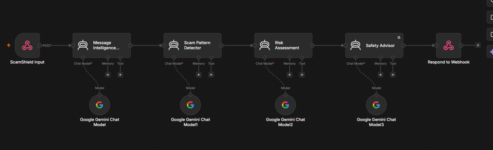
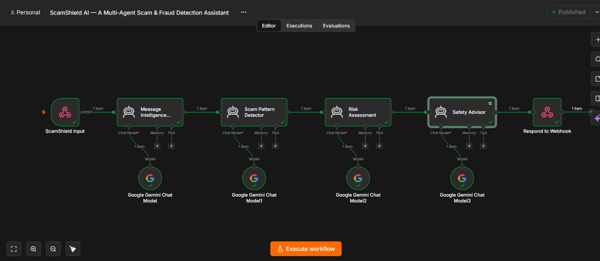
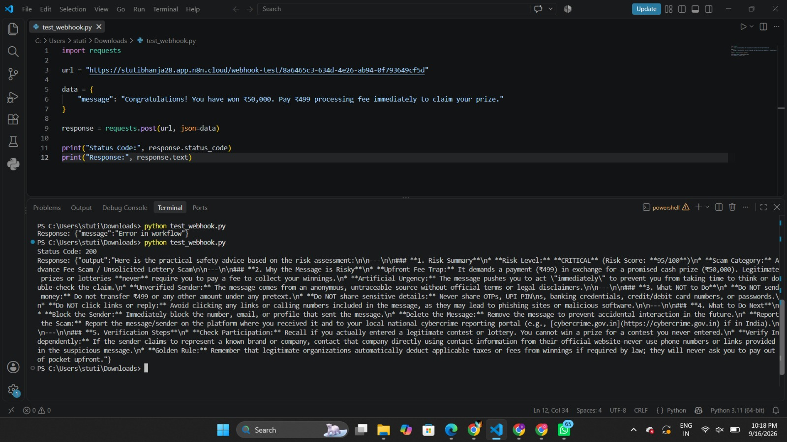

# 🛡️ ScamShield AI — Multi-Agent Scam & Fraud Detection Assistant

## 📌 Problem Statement

Scam and fraud messages such as phishing texts, fake lottery notifications, investment scams, KYC scams, and impersonation attempts are becoming increasingly sophisticated and difficult for people to identify.

Many users may not have the technical knowledge required to determine whether a suspicious message is safe or potentially fraudulent.

**ScamShield AI** provides an AI-powered second opinion by analyzing a suspicious message through multiple specialized AI agents and providing a risk assessment, identified scam patterns, and practical safety recommendations.

---

## 🧠 Approach

This project follows **Option 2 — Multi-Agent AI System**.

ScamShield AI is built using **n8n** as the workflow orchestration platform and **Google Gemini** as the Large Language Model.

Instead of relying on a single AI prompt, the message is processed sequentially by four specialized agents. Each agent has a clearly defined responsibility and passes its analysis to the next agent.

### Architecture

```text
User Message
     ↓
Message Intelligence Agent
     ↓
Scam Pattern Detector Agent
     ↓
Risk Assessment Agent
     ↓
Safety Advisor Agent
     ↓
Final Result
```

---

## 🤖 Agent Roles

| Agent                           | Responsibility                                                                          |
| ------------------------------- | --------------------------------------------------------------------------------------- |
| **Message Intelligence Agent**  | Analyzes the incoming message and extracts its intent, tone, and important information. |
| **Scam Pattern Detector Agent** | Identifies possible scam patterns, tactics, and suspicious indicators.                  |
| **Risk Assessment Agent**       | Evaluates the detected indicators and determines the overall risk level.                |
| **Safety Advisor Agent**        | Converts the analysis into clear and practical safety recommendations for the user.     |

Each agent performs a different task, and the output from one stage is passed to the next stage.

---

## 🛠️ Tech Stack

* **n8n** — Workflow orchestration and automation
* **Google Gemini** — Large Language Model powering the AI agents
* **Webhook** — Receives the user's suspicious message
* **Python** — Lightweight test client
* **Python Requests** — Sends HTTP requests to the n8n webhook

---

## 🔄 Workflow / Node Explanation

### 1. ScamShield Input — Webhook

Receives the suspicious message through an HTTP `POST` request.

### 2. Message Intelligence Agent

Analyzes the message and extracts important information such as intent, tone, urgency, requests, and other relevant indicators.

### 3. Scam Pattern Detector Agent

Uses the extracted information to identify possible scam or fraud patterns.

Examples include:

* Phishing
* KYC scams
* OTP scams
* Lottery/prize scams
* Investment scams
* Payment-related scams
* Impersonation

### 4. Risk Assessment Agent

Evaluates the detected indicators and determines the overall level of risk.

For example:

```text
Risk Level: HIGH
```

### 5. Safety Advisor Agent

Provides practical recommendations based on the identified risk.

For example:

```text
Do not click suspicious links.
Do not share OTPs or banking credentials.
Verify the request through an official source.
```

### 6. Final Result

The workflow returns the combined analysis as the final structured response.

---

## ⚙️ How It Works

1. The user provides a suspicious message.
2. The message is sent to the ScamShield Input webhook.
3. The Message Intelligence Agent analyzes the message.
4. The Scam Pattern Detector identifies possible scam patterns.
5. The Risk Assessment Agent evaluates the level of risk.
6. The Safety Advisor provides actionable safety recommendations.
7. The final structured analysis is returned to the user.

The workflow successfully processes the input through all four specialized AI agents.

---

## 📥 Sample Input

```text
Congratulations! You have won ₹50,000.
Click the link below and pay ₹500 to claim your prize immediately.
```

---

## 📤 Sample Output

```text
Risk Level: HIGH

Scam Type:
Lottery / Prize Scam

Red Flags:
- Unexpected prize notification
- Urgent action requested
- Payment requested
- Suspicious link

Safety Recommendation:
Do not click the link or send money.
Verify the message through an official source.
```

> The sample output above represents the type of structured analysis produced by the workflow. For the final repository, the displayed example should match an actual output from your executed workflow.

---

## 🎥 Demo

### n8n Workflow



### Successful Workflow Execution

The workflow was successfully executed through n8n, with all four specialized AI agents processing the input sequentially.



### Final AI Output

The final response contains the detected scam pattern, risk assessment, and recommended safety actions.



---

## 🧪 Working Demonstration

The project was tested by sending a message to the n8n webhook using a Python test client.

The request follows this flow:

```text
Input Message
     ↓
n8n Webhook
     ↓
Message Intelligence
     ↓
Scam Pattern Detection
     ↓
Risk Assessment
     ↓
Safety Advisor
     ↓
Final Structured Response
```

All four AI agents execute successfully as part of the workflow.

---

## 🚀 Setup & Usage

### 1. Import the Workflow

Import the following workflow file into your n8n instance:

```text
ScamShield-AI-Workflow.json
```

### 2. Configure Gemini Credentials

Add your Google Gemini credentials to the Gemini Chat Model nodes.

**Never upload or expose your API key in the GitHub repository.**

### 3. Publish the Workflow

Publish the workflow in n8n to activate the production webhook.

### 4. Install Python Dependency

```bash
pip install -r requirements.txt
```

### 5. Run the Test Client

```bash
python test_webhook.py
```

---

## ✨ What Makes This Project Unique?

* Uses a genuine multi-agent architecture rather than relying on a single LLM prompt.
* Each agent has a distinct responsibility.
* Information is passed sequentially between agents.
* Addresses a real-world problem involving scam and fraud messages.
* Combines AI reasoning with workflow automation using n8n.
* Produces both risk analysis and practical safety recommendations.

---

## ⚠️ Limitations

* The system provides an AI-based assessment and should not be treated as a guaranteed scam verdict.
* Detection quality depends on the message provided and the AI model's analysis.
* The system does not directly block transactions, links, calls, or accounts.
* Users should independently verify suspicious requests through official channels.

---

## 🔮 Future Improvements

* Support for multiple languages.
* Email and SMS analysis.
* Scam URL analysis.
* Integration with verified threat-intelligence sources.
* More detailed risk scoring.
* Additional specialized agents.
* User-friendly web interface.
* Continuous evaluation using a larger collection of scam and legitimate messages.

---

## 📂 Project Structure

```text
ScamShield-AI/
│
├── README.md
├── ScamShield-AI-Workflow.json
├── test_webhook.py
├── requirements.txt
│
├── scamshield-workflow.png
├── scamshield-execution.png
└── scamshield-output.png
```

---

## 👩‍💻 Project

**ScamShield AI — Multi-Agent Scam & Fraud Detection Assistant**

Built using **n8n + Google Gemini**.
